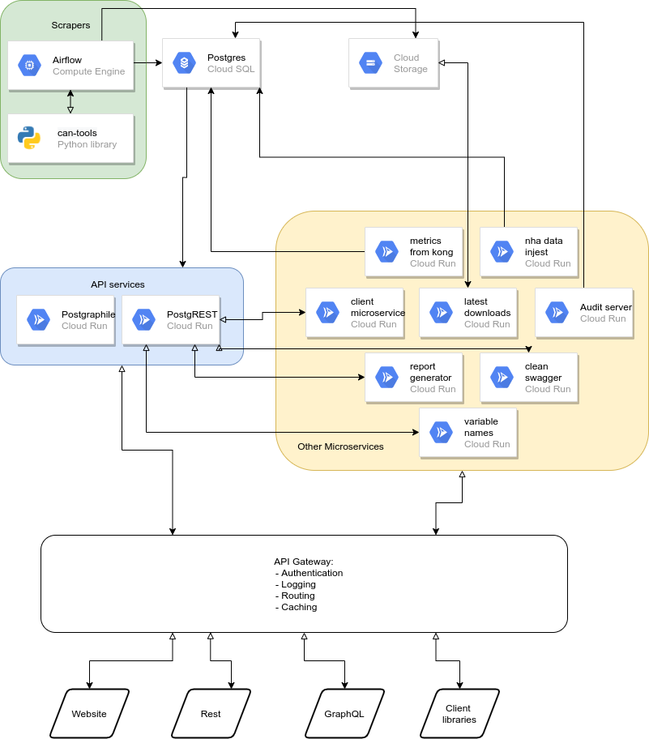

Overview
===========================

The overall microservice architecture we use is shown in the diagram below:

In, words, these components are

1. Scrapers: these are open source scrapers written in Python. The repository is
   here https://github.com/covid-projections/can-scrapers
2. Database: we store all data in a postgrestql database
3. API: We have REST and GraphQL APIs. They are automatically generated using
   the PostgREST and postgraphile libraries
4. Client Libraries: We have client libraries in Python, R, and Julia that
   integrate with the REST API
5. API Gateway: we have a Kong API gateway that sits in front of all user
   requests and handles things like caching, routing, and authentication
6. Other services: we have a handful of other microservices that perform
   specific functions. These are contained in docker containers that communicate
   over HTTP and are managed by Google Cloud run

We have a few comments about each of the 6 component groups below

Scrapers
--------

We have written about 70 scrapers to gather data from various sources. The
sources are primarily state and county level dashboards, typically operated by
the local government itself or the local health department. Other scrapers pull
in data from sources like the New York Times, HHS, Our World in Data (for
international data), and CovidTrackingProject.

Running Scrapers: Apache Airflow
--------------------------------

Inside the `can-scrapers <https://github.com/covid-projections/can-scrapers>`_
repository there is a services/airflow diretory that contains infrastructure
code for running all scrapers using Apache Airflow. 

Most of the Airflow DAGs are automatically generated. This happens by importing
:code:`can_tools` and checking for all subclases of a particular base class. For
each of these subclasses we generate a dag that calls :code:`get` to fetch the
data and :code:`put` to store it in the database. The :code:`get` methods are
all specialized for each scraper. The :code:`put` method can also be
specialized, but often the one from the base class is sufficient.

Each DAG runs once every two hours. We assign a random execution time to each
DAG so that they don’t all try to run at the exact same time. This helps us
better utilize compute resources.

Database
--------

When airflow runs a scraper from can_tools, all data ends up in a postgresql
database. The database has three main schemas:

1. data: this stores the raw data in a mostly normalized way.
2. meta: This schema stores metadata such as lookup tables for variable id ↔
   variable name and state/county metadata
3. api: this is the schema that determines the user facing API. It mostly
   contains SQL views that join together tables from data and meta schemas to
   control the user experience

The client libraries/APIs (see below) only access the :code:`api` schema

We run the database using Google Cloud SQL.

API
---

We provide REST and GraphQL APIs to our users

REST API
********

The REST API is automatically generated using
`PostgREST <http://postgrest.org/en/v7.0.0/>`_. PostgREST authenticates to the
database via read-only credentials and automatically generates endpoints for
each table or view in the :code:`api` schema.

PostgREST also auto-generates documentation as a swagger/OpenAPI json file. We
use this on our website to populate the doc page, in the client libraries to
auto-generate classes for each endpoint, and to create a postman collection as
part of their featured list of covid APIs
(https://postman-toolboxes.github.io/covid-19/#featured-collections)

GraphQL API
***********

We also have a complete GraphQL API. This is also automatically generated, but
by the [postgraphile](https://www.graphile.org/postgraphile/) library.

The endpoint is https://api.covidcountydata.org/graphql and an interactive
GraphiQL playground can be found at https://api.covidcountydata.org/graphiql

Client Libraries
****************

Using the swagger.json file produced by PostgREST we have auto-generated client
libraries in Python, R, and Julia

They all provide the same set of core features, including

- Declarative query building: users specify what data they would like to end up
  with and we do the work of making all requests, merging/aligning datasets,
  converting to long form, and returning a dataframe with all data
- API key handling: there is a register method in each client library that
  handles requesting and storing API keys. If a user calls register and gives
  their email address, the API key will be looked up or generated and returned
  to the user. The API key is then stored in the user’s home directory and will
  be used for all subsequent API interactions, even in future programming
  sessions. Users also have the option to manually pass an API key (perhaps
  looked up from an environment variable) when creating a client
- Documentation/introspection: the library also hooks into each language’s
  native system for documentation and introspection. For example, in Python each
  API endpoint is an method on the Client class. These methods can be searched
  interactively using tab completion. Also if you are in IPython or Jupyter you
  can use `?` to get the auto-generated documentation directly from the
  swagger.json file

API Gateway
-----------

We route all requests to https://api.covidcountydata.org/XXXX through a single
API gateway

This gateway is creating using the open source `Kong API
gateway <https://konghq.com/kong/>`_ library and handles a variety of tasks for
us:

- Generating API keys for users: using key-auth plugin
  (https://docs.konghq.com/hub/kong-inc/key-auth/
- Checking API keys on each request: again using key-auth plugin
- Logging/tracking: All requests are logged with a custom microservice (see
  below) and stored in our Postgres database. This happens using the Kong
  http-log plugin (https://docs.konghq.com/hub/kong-inc/http-log/)
- Routing: we have a variety of servers/services running. Kong will inspect the
  requested url and headers and route to the correct underlying server.
- Caching: certain requests/endpoints can be cached by the server to avoid
  un-necessary hits to the database. This is done using the Kong proxy-cache
  plugin (https://docs.konghq.com/hub/kong-inc/proxy-cache/)
- request or response transformation: some of the backend microservices require
  certain headers to be set. In these cases we use the request transformer
  (https://docs.konghq.com/hub/kong-inc/request-transformer) and response
  transformer (https://docs.konghq.com/hub/kong-inc/response-transformer)
  plugins.

Other Services
--------------

We have a few other microservices that support our APIs

These are all contained in docker containers and run an HTTP server for
processing requests

Each of these is deployed and auto-scaled using Google Cloud Run

The microservices are:

- Audit server: we prototyped a feature on our website to allow crowd-sourced
  auditing of or data. Users would visit the audit page of the site, we would
  select a specific scraper for them to audit. Once selected, we would show the
  scrapers current data as well as open an iframe containing the scraper’s url
  so users can verify that each datapoint we were extracting from the source was
  correct. Users could then fill out a form on the website. The form’s contents
  were sent to this audit server and logged in our database. It didn’t gain
  traction or make it out of PoC
- clean_swagger: the swagger file generated by PostgREST is a little messy. We
  have simple python service that obtains the raw PostgREST swagger.json and
  cleans it up before returning to places like the client library, website, or
  postman collection.
- client-microservice: we are about to launch a dataset customizer feature to
  our web page. This is basically a GUI version of the client libraries. On the
  website users can select which datasets they’d like and what filters (e.g.
  geography, time windows) they want to apply. Once the request is built up by
  web users, the site sends a request to this microservice, which is a very thin
  wrapper around our Python client. The Python client will request the data,
  prepare the return and send back to the frontend for a clean/custom download
- latest_downloads: we have a download csv feature on the website. This is
  similar to CANs API and is a thin layer that sits on top of a cloud storage
  bucket. We had user feedback that we wanted to customize the filename of the
  downloaded files to include the date the data was downloaded. This
  latest_downloads microservice gets a request for a particular dataset to
  download, fetches the most recent version of that from cloud storage bucket,
  and then returns it to the user with the current date added to the file name.
  Probably overkill to have a whole microservice for this, but it weighed in at
  less than 40 lines of code, so it was a pretty easy solution to implement and
  maintain.
- metrics-from-kong: this microservice implements our custom logging middleware.
  All requests to the API are relayed from Kong to this micro service where we
  can process the request and store the output in our database
- nha_data_injest: this is a microservice that handles scraping data from the
  Nevada Health association pdfs CAN has been receiving. It wraps one of the
  scrapers in can_tools and exposes it as a triggerable cloud function so it
  can process files on demand, as they come in
- postgraphile: This is the microservice that runs the postgraphile library
  providing our GraphQL API
- postgrest: This is the microservice that runs the PostgREST library and
  provides our REST api
- report_generator: This microservice is responsible for reporting when new
  variables first entered our database. The output is rendered at the bottom of
  https://covidcountydata.org/data to provide a “changelog” for when new data
  came into the system.
- variable_names: this microservice provides support for the custom data
  downloader feature we are about to release. For each endpoint it returns a
  list of unique variable names contained within the dataset. This allows the
  front-end to allow filtering in/out variables within a dataset. It is a
  microservice so we can simplify front-end coding and so that this variable
  list can be cached by Kong and we can avoid unnecessary trips to the database
  for this info.

